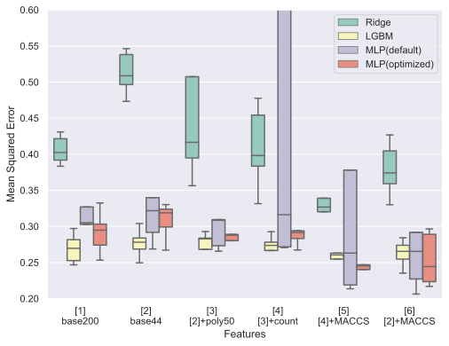

<!-- _class: title -->

# Q2 解法について

～どうやってリベンジを果たしたのか～

---
<!--
class: slides
footer: "**2021/01/22**"
paginate: true
-->

# あなたはどんな人？

* yu340102
* とある高専卒
* T大M2
* 生活道路での自動運転実現に関する研究
* 大学院の授業でデータサイエンスに関する授業を取る
* 最近はRFAと桃鉄が熱い
* twitter: @yu340102

---

# 何で参加したの？

* 就活で athletics に登録 → Slack でコンペのことを知る
* 第4回Brain(s)に参加 → 序盤に一瞬LB載る程度
* Award会に参加 → めちゃくちゃ化学に詳しい人ではなく，色々試した人が入賞していた  
→ 第5回（今回）はリベンジのつもりで入賞目指して，参加した．

---

# どんなこと考えて取り組んだの？

* テーブルデータ分析の基本を一通りやるつもりでいた
* ドメイン知識は分からないから考えないことにした
* 全力出し切って，特徴量生成～モデルのチューニングまで一通りできたら感無量というスタンス

---

# 結論から言ってよ

## **情報収集 × 試行回数 → 1st**
* 基礎情報
 Kaggleで勝つデータ分析の技術
 各ライブラリのDocument
* ドメイン情報
   Slackの過去メッセージ
   第4回解法ブログ
   RDKit, mordred, FingerPrintに関するQiita等のまとめ記事
* 試行回数
   とにかくsub
   何かやれることはないか考える

---

# ベストスコアはどうやって出したの？

* 特徴量は291
* モデルはMLPRegressor(from sklearn)
* 5-fold CV の平均値を提出

---

# 概要

* 特徴量生成
  記述子（RDKit, mordred）
  フィンガープリント（Morgan FP, MACCS Keys）
  Count（各原子や記号（=,-,+等），SMILESの文字列長）
* 特徴量選択
  0のカラムを除去
  LightGBMのfeature importance(gainで高いもの)
  RDKitの記述子 + MACCS Keys + Count = 291変数
* モデル選択
  基本LGBM
  sklearnにMLPあること知って後から採用
  パラメータはどっかのタイミングでColab + Optunaでやったもの
* アンサンブル
  5-fold CV の平均
  LGBM+MLP+SVR→LinearReg のstackingとかも試したけどベストスコアではなかった

---

# EDA

## Pandas-Profiling 好き

* 0ばっかり
* MolLogP(?)はまともな分布
* logとかとれば良かったのかな

---

# 何でいいスコア出たん？

## **MACCS Keys + MLP が効いた説**

* 5-folds CV
* MACCS Keys を足すとMSEが下がっている
* MACCS Keys
全部で166の部分構造についての有無を調べ上げたもの
全部で167ビットのフィンガープリント
部分構造を有:1 無:0
* Q&Aにて，「ベンゼン環があるかどうか，先に何が付いているか」
→ 環構造の先に何が付いているかを表現していた可能性
* 

---

# 何でいいスコア出たん？

## **MACCS Keys + MLP が効いた説**

* 5-folds CV
* MACCS Keys を足すと下がっている
* MACCS Keys: 全部で166の部分構造についての有無を調べ上げたもので，RDKit内の情報保持のために1ビット使っているため全部で167ビットのフィンガープリントになります．部分構造を有する場合は1が，ない場合は0が格納されています．
* Q&Aにて，「ベンゼン環があるかどうか，先に何が付いているか」
→ 環構造の先に何が付いているかを表現していた可能性

---

# 大変だったこと

* 一回も中間ランキングに載らなかった
* trackのスコアばかり良くなる  
  → 0.15台
* 採点ルール分かっていなかった  
  → とにかく出しまくって安心していた
  → ルール確認 is 大事

---

# まとめと感想

* 色々試したらたまたまいいスコアが出た
* 今後はもっと**分析**して結果を出したい
* リベンジできてめちゃくちゃ嬉しい
* 化学分からなくても何とかなった
* ルールはよく確認したい
* (データ分析コンペは無料のソシャゲ...？ 本業に支障がないようにしたい)
* 解法について，ブログと書いてみたいなあ

---

# 参考

<!-- 
  font-size: 20px;
  font-family: "Noto Sans CJK JP DemiLight";
  position: absolute;
  left: 50px; top: 100px;
} -->

* 第4回総合1位の方のブログ  
https://blog.tan5o.com/2020/08/%E5%AF%8C%E5%A3%AB%E3%83%95%E3%82%A3%E3%83%AB%E3%83%A0%E3%82%B3%E3%83%B3%E3%83%9A%E7%B7%8F%E5%90%881%E4%BD%8D%E8%A7%A3%E6%B3%95%E3%82%A2%E3%83%97%E3%83%AD%E3%83%BC%E3%83%81%E5%8C%96%E5%90%88%E7%89%A9%E3%81%AE%E6%BA%B6%E8%A7%A3%E5%BA%A6%E4%BA%88%E6%B8%AC2%E4%BD%8D%E5%A4%89%E7%95%B0%E6%80%A7%E4%BA%88%E6%B8%AC2%E4%BD%8D/
* メンター（yktsnd）さんのブログ  
https://arukuhito.hatenadiary.com/entry/%E7%AC%AC4%E5%9B%9E%E5%AF%8C%E5%A3%AB%E3%83%95%E3%82%A4%E3%83%AB%E3%83%A0%E3%82%B3%E3%83%B3%E3%83%9A%E5%8F%82%E5%8A%A0%E8%A8%98%E9%8C%B2
* SMILES記法の化合物のMACCS keysを求める  
https://qiita.com/motthy/items/87495920896cdfaf169f
* mordredで特定の記述子だけの計算を高速に行う
https://qiita.com/kimisyo/items/1375a18255d6c7c80d1b
* RDKitでフィンガープリントを使った分子類似性の判定
https://future-chem.com/rdkit-fingerprint/#MACCS_Keys
* 【VS Code + Marp】Markdownから爆速・自由自在なデザインで、プレゼンスライドを作る
https://qiita.com/tomo_makes/items/aafae4021986553ae1d8
* 今回のコード
https://github.com/yu340102/brains-q2