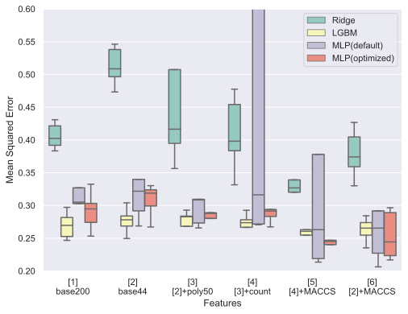
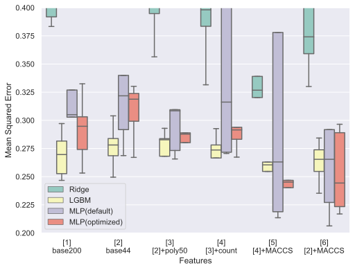

## はじめに

富士フイルム主催のデータ分析コンテスト，第5回Brain(s)コンテストに参加してきました．コンテストでは，「Q2. 化合物の分配係数予測」と「Q3. 化合物のタンパク質の結合予測」の2つの問題があり，Q2が1位，Q3が3位という結果でした．今回は，Q2の解法についてまとめていこうと思います．

## 何で参加したの？

* 就活で athletics に登録 → Slack でコンペのことを知りました．
* 第4回Brain(s)に参加 → 序盤に一瞬LB載る程度で入賞とはかけ離れた結果に．
* Award会に参加 → めちゃくちゃ化学に詳しい人ではなく，色々試した人が入賞していました．
→ 第5回（今回）はリベンジのつもりで入賞目指して，参加しました．

## どんなこと考えて取り組んだの？

* テーブルデータ分析の基本を一通りやるつもりでいました．
* ドメイン知識は分からないから考えないことにしました．
* 全力出し切って，特徴量生成～モデルのチューニングまで一通りできたら感無量というスタンスで取り組みました．

## 前提

* 採点実行環境の制限は、実行時間 10分、メモリ 512 MB、アップロード容量 10 MB
* 外部データ使用禁止
* 提出するzipには，学習に使用したファイルと学習済みモデル，condaの環境を記述したファイル（env.yaml）を含める．
（conda-forgeは使えなかった）
* 採点は1日1回（12時時点で最新の提出モデル）
* 評価はMSE

## 結論から言ってよ

#### **情報収集 × 試行回数 → 1st**

* 基礎情報収集
    * Kaggleで勝つデータ分析の技術
    実装が載っているので勉強したことをすぐ試せて便利
    [asin:B07YTDBC3Z:detail]
    * 使用ライブラリのDocument
    どのハイパーパラメータ調整すればいいのか分からないので
* ドメイン(?)情報
    * コンテストSlackの過去メッセージ  
    過去のマテリアルズ・インフォマティクスに関する特徴量生成に使用されたライブラリを知るため
    * 第4回解法ブログ  
    前回とテーマ（マテリアルズ・インフォマティクス）が同じなので参考にしました．
    * RDKit, mordred, FingerPrintに関するQiita等のまとめ記事  
    関連するライブラリで何ができるかを知るため＆てっとり早く実装するため
* 試行回数
    * とにかくsub
    * 何かやれることはないか考える

## ベストスコアはどうやって出したの？

* 特徴量は291
* モデルはMLPRegressor(from sklearn)
* 5-fold CV の平均値を提出  

| 名前 | 意味 |  
---- | ----  
| Base200 | データセットに元からあった数値変数200列 |  
| Base44 | Base200からLightGBMで特徴選択した44列 |
| Poly50 | [PolynomicalFeatures()](https://scikit-learn.org/stable/modules/generated/sklearn.preprocessing.PolynomialFeatures.html?highlight=poly#sklearn.preprocessing.PolynomialFeatures) をBase200に適用して作成した2次の交差項20100列からLightGBMで特徴選択した50列 |
| SMILES | 分子の化学構造を文字列で表現したもの．この情報から様々な説明変数を作成する． |  
| Count | SMILESに記されている原子の数や結合の数を単にカウントしたもの |  
| MACCS Keys | 分子フィンガープリントの一種 |  
| MLP | [MLPRegressor()](https://scikit-learn.org/stable/modules/generated/sklearn.neural_network.MLPRegressor.html?highlight=mlpr) |  

## 概要

* 特徴量生成
    * 記述子（RDKit, mordred）
    * フィンガープリント（Morgan FP, MACCS Keys）
    * Count（各原子や記号（=,-,+等），SMILESの文字列長）
* 特徴量選択
    * 0のカラムを除去
    * LightGBMのfeature importance(gainで高いもの)
    * RDKitの記述子 + MACCS Keys + Count = 291変数
* モデル選択
    * 基本LGBM
    * sklearnにMLPあること知って後から採用
    * パラメータはどっかのタイミングでColab + Optunaでやったもの
* アンサンブル
    * 5-fold CV の平均
    * LGBM+MLP+SVR→LinearReg のstackingとかも試したけどベストスコアではなかった

## EDA

#### Pandas-Profiling 好き

* 0ばっかり
* MolLogP(?)はまともな分布
* logとかとれば良かったのかな

## 何でいいスコア出たん？

#### **MACCS Keys + MLP が効いた説**

* 5-folds CV
* MACCS Keys を足すとMSEが下がっている
* MACCS Keys
全部で166の部分構造についての有無を調べ上げたもの
全部で167ビットのフィンガープリント
部分構造を有:1 無:0
* Q&Aにて，「ベンゼン環があるかどうか，先に何が付いているか」
→ 環構造の先に何が付いているかを表現していた可能性

## 何でいいスコア出たの？

#### **MACCS Keys + MLP が効いた説**

* 5-folds CV の結果を図に示します．
* MACCS Keys を足すとMSEが下がっているのが分かるかと思います．
* MACCS Keysとは？  
    * 全部で166の部分構造についての有無を調べ上げたもの
    * 全部で167ビットのフィンガープリント
    * 部分構造を有:1 無:0
* 運営に対する質問会にて，「ベンゼン環があるかどうか，その先に何が付いているか」調べると何かいいことがあるかもと聞いていました．  
→ MACCS Keys が環構造の先に何が付いているかを表現していたと考えています．

## 大変だったこと

* 一回も中間ランキングに載らなかった...  
* track(public)のスコアばかり良くなる  
  → MSEが0.15台まで下がるも，privateスコアは0.38台とか
* 採点ルール分かっていなかった  
  → 提出したモデル全てが採点対象だと思い，とにかく出しまくって安心していました．
  →
  → ルール確認 is 大事

## まとめと感想

* 色々試したらたまたまいいスコアが出た
* 今後はもっと**分析**して結果を出したい
* リベンジできてめちゃくちゃ嬉しい
* 化学分からなくても何とかなった
* ルールはよく確認したい
* (データ分析コンペは無料のソシャゲ...？ 本業に支障がないようにしたい)
* 解法について，ブログと書いてみたいなあ

## 参考

* Brain(s)コンテスト第4回総合1位の方のブログ  
https://blog.tan5o.com/2020/08/%E5%AF%8C%E5%A3%AB%E3%83%95%E3%82%A3%E3%83%AB%E3%83%A0%E3%82%B3%E3%83%B3%E3%83%9A%E7%B7%8F%E5%90%881%E4%BD%8D%E8%A7%A3%E6%B3%95%E3%82%A2%E3%83%97%E3%83%AD%E3%83%BC%E3%83%81%E5%8C%96%E5%90%88%E7%89%A9%E3%81%AE%E6%BA%B6%E8%A7%A3%E5%BA%A6%E4%BA%88%E6%B8%AC2%E4%BD%8D%E5%A4%89%E7%95%B0%E6%80%A7%E4%BA%88%E6%B8%AC2%E4%BD%8D/
* yktsndさんのブログ  
https://arukuhito.hatenadiary.com/entry/%E7%AC%AC4%E5%9B%9E%E5%AF%8C%E5%A3%AB%E3%83%95%E3%82%A4%E3%83%AB%E3%83%A0%E3%82%B3%E3%83%B3%E3%83%9A%E5%8F%82%E5%8A%A0%E8%A8%98%E9%8C%B2
* SMILES記法の化合物のMACCS keysを求める  
https://qiita.com/motthy/items/87495920896cdfaf169f
* mordredで特定の記述子だけの計算を高速に行う
https://qiita.com/kimisyo/items/1375a18255d6c7c80d1b
* RDKitでフィンガープリントを使った分子類似性の判定
https://future-chem.com/rdkit-fingerprint/#MACCS_Keys
* 【VS Code + Marp】Markdownから爆速・自由自在なデザインで、プレゼンスライドを作る
https://qiita.com/tomo_makes/items/aafae4021986553ae1d8
* 今回のコード
https://github.com/yu340102/brains-q2