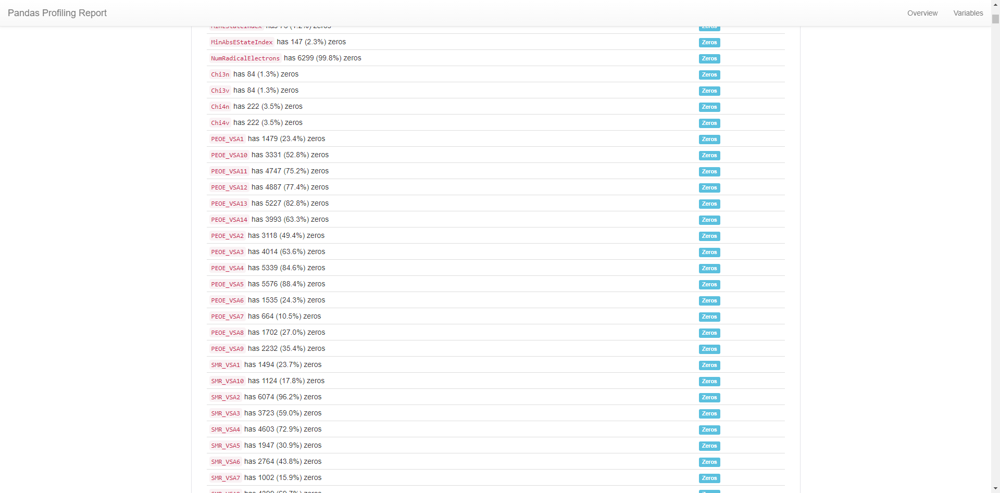

# 第5回 富士フイルム Brain(s) 参加記録（Q2. 1位解法・アプローチ）

## はじめに

富士フイルム主催のデータ分析コンテスト，第5回Brain(s)コンテストに参加してきました．コンテストでは，「Q2. 化合物の分配係数予測」と「Q3. 化合物のタンパク質の結合予測」の2つの問題があり，Q2が1位，Q3が3位という結果でした．  
[https://twitter.com/yu340102/status/1352564092855148545:embed#富士フイルムのBrain(s)コンテストに参加して，Q2 1位Q3 3位賞品 FUJIFILM X100V いただきました．大事に使います！ありがとうございました！#brainsconQ2のコード… https://t.co/hPVCVKDNaH]  
今回は，Q2の解法について自身のLT会の資料を（~~コピペして~~）基にまとめていこうと思います．
また，* 今回のコードは以下においてあります．
<https://github.com/yu340102/brains-q2>

## 何で参加したの？

* 就活で athletics に登録 → athletics の Slack でコンペのことを知りました．
* 第4回Brain(s)コンテストに参加 → 序盤に一瞬LB載る程度で入賞とはかけ離れた結果に．
* Award会に参加 → めちゃくちゃ化学に詳しい人ではなく，色々試した人が入賞していました．  
→ 化学も機械学習も分からないけど，第5回（今回）はリベンジのつもりで入賞目指して，参加しました．

## どんなこと考えて取り組んだの？

* テーブルデータ分析の基本を一通りやるつもりでいました．  
どれかに力を入れるというよりは，満遍なく試したいという気持ちで参加しました．
* ドメイン知識は分からないから，深く考えないことにしました．  
* 全力出し切って，特徴量生成～モデルのチューニングまで一通りできたら感無量というスタンスで取り組みました．

## 前提

* 採点実行環境の制限は、実行時間 10分、メモリ 512 MB、アップロード容量 10 MB．
* 外部データ使用禁止．
* 提出するzipには，学習に使用したファイルと学習済みモデル，condaの環境を記述したファイル（env.yaml）を含める．
（conda-forgeは使えなかった）
* 採点は1日1回（12時時点で最新の提出モデル），富士フイルム社内の秘密データを対象に行われる．
* 評価はMSE．

## 結論から言うと

### **情報収集 × 試行回数 → 1st**

様々な方面からの情報収集と集めた情報を一つでも多く試すことが1位という結果に繋がったのかなと思います．どんな情報を集めたかは，以下に示します．

* 基礎情報収集
  * Kaggleで勝つデータ分析の技術
    良本．実装が載っているので勉強したことをすぐ試せて便利．
    [asin:B07YTDBC3Z:detail]
  * 使用ライブラリのDocument
    どのハイパーパラメータ調整すればいいのか分からないので，何回も観ました．
* ドメイン(?)情報
  * コンテストSlackの過去メッセージ  
    過去のマテリアルズ・インフォマティクスに関する特徴量生成に使用されたライブラリを知るために過去のメッセージを遡って確認し，参考にしました．
  * 第4回解法ブログ  
    前回とテーマ（マテリアルズ・インフォマティクス）が同じなので参考にしました．
  * RDKit, mordred, FingerPrintに関するQiita等のまとめ記事  
    関連するライブラリで何ができるかを知るため＆てっとり早く実装するために重宝しました．
* 試行回数
  * とにかくsubmit  
  publicスコアと言えど，何か出して採点を見ることでモチベーション維持できたかなと思います．
  * 何かやれることはないか考える  

## ベストスコアはどうやって出したの？

* 特徴量は291
* モデルはMLPRegressor(from sklearn)
* どこかのタイミングで,optunaを使って調整した（≠ 最終的な特徴量に対して調整してはいない）
* 5-fold CV の平均値を提出  

| 名前 | 意味 |  
---- | ----  
| Base200 | データセットに元からあった数値変数200列 |  
| Base44 | Base200からLightGBMで特徴選択した44列 |
| Poly50 | [PolynomicalFeatures()](https://scikit-learn.org/stable/modules/generated/sklearn.preprocessing.PolynomialFeatures.html?highlight=poly#sklearn.preprocessing.PolynomialFeatures) をBase200に適用して作成した2次の交差項20100列からLightGBMで特徴選択した50列 |
| SMILES | 分子の化学構造を文字列で表現したもの．この情報から様々な説明変数を作成する． |  
| Count | SMILESに記されている原子の数や結合の数を単にカウントしたもの |  
| MACCS Keys | 分子フィンガープリントの一種 |  
| MLP | [MLPRegressor()](https://scikit-learn.org/stable/modules/generated/sklearn.neural_network.MLPRegressor.html?highlight=mlpr) |  

## 取り組んだことの概要

* 特徴量生成
  * 記述子（RDKit, mordred）
  * フィンガープリント（Morgan FP, MACCS Keys）
  * Count（各原子や記号（=,-,+等），SMILESの文字列長）
* 特徴量選択
  * 0のカラムを除去
  * LightGBMのfeature importance(gainで高いもの)
  * RDKitの記述子 + MACCS Keys + Count = 291変数
* モデル選択
  * 基本LGBM
  * sklearnにMLPあること知って後から採用
  * パラメータはどっかのタイミングでColab + Optunaでやったもの
* アンサンブル
  * 5-fold CV の平均
  * LGBM+MLP+SVR→LinearReg のStackingとかも試したけどベストスコアではなかった

## EDA

### Pandas-Profiling 好き

* あんまり深く考えずデータ渡すだけでEDAしてくれるから好き．
* 0ばっかり．
* まともな分布の特徴量が少ない．
* MolLogP(?)はまともな分布．
* logとかとれば良かったのかなと振り返って思います．

 

## 何でいいスコア出たの？

### **MACCS Keys + MLP が効いた説**  

入力の特徴量を変えた5-folds CV の結果を，図に示します．

* Ridge回帰やdefault パラメータのMLPは特徴量によってスコアが変わった．
* LGBM や パラメータチューニングしたMLPはある程度のスコアを一定して出している．
* MACCS Keys を足すとLGBMよりMLPの方がMSEが下がっている．
* MACCS Keysとは？  
  * 全部で166の部分構造についての有無を調べ上げたもの
  * 全部で167ビットのフィンガープリント
  * 部分構造を有:1 無:0
* 運営に対する質問会にて，「ベンゼン環があるかどうか，その先に何が付いているか」調べると何かいいことがあるかもと聞いていました．  
→ MACCS Keys が環構造の先に何が付いているかを表現していたと考えています．

MACCS Keys が化合物の部分構造を表現することで，環構造の有無や環構造にどんな分子が付いているかという特徴量が加わり，MLPがLightGBMでは反映仕切れなかった，非線形性や変数間の相互作用を反映した結果MSEスコアが下がったのかなと考察します（素人なので詳しいことは分かりません）．

## 大変だったこと

* 一回も中間ランキングに載らなかった...  
* track(public)のスコアばかり良くなる  
  → MSEが0.15台まで下がるも，privateスコアは0.38台とか
* 採点ルール分かっていなかった  
  → 提出したモデル全てが採点対象だと思い，とにかく出しまくって安心していた．  
  → 終了3日前に気づいて，今までどんな組み合わせが採点対象になっていたか分からなくて焦る（提出日時と提出zipファイルを照らし合わせてどんなモデルを採点対象となっていたか調べるのに時間使う...）．  
  → **ルール確認は大事**

## まとめと感想

* 正直なところ，色々試したらたまたまいいスコアが出たって感じです．
* 今後はもっと**分析**して，結果を出したいと思います．
* ただ，リベンジできてめちゃくちゃ嬉しい．
* 運営の予想通り，（Q2）化学分からなくても何とかなった．
* ~~ルールはよく確認しないとダメ~~
* 解法について，ブログと書いてみたいなあ → 書きました．

## 参考

* Brain(s)コンテスト第4回総合1位の方のブログ  
<https://blog.tan5o.com/2020/08/%E5%AF%8C%E5%A3%AB%E3%83%95%E3%82%A3%E3%83%AB%E3%83%A0%E3%82%B3%E3%83%B3%E3%83%9A%E7%B7%8F%E5%90%881%E4%BD%8D%E8%A7%A3%E6%B3%95%E3%82%A2%E3%83%97%E3%83%AD%E3%83%BC%E3%83%81%E5%8C%96%E5%90%88%E7%89%A9%E3%81%AE%E6%BA%B6%E8%A7%A3%E5%BA%A6%E4%BA%88%E6%B8%AC2%E4%BD%8D%E5%A4%89%E7%95%B0%E6%80%A7%E4%BA%88%E6%B8%AC2%E4%BD%8D/>
* yktsndさんのブログ  
<https://arukuhito.hatenadiary.com/entry/%E7%AC%AC4%E5%9B%9E%E5%AF%8C%E5%A3%AB%E3%83%95%E3%82%A4%E3%83%AB%E3%83%A0%E3%82%B3%E3%83%B3%E3%83%9A%E5%8F%82%E5%8A%A0%E8%A8%98%E9%8C%B2>
* SMILES記法の化合物のMACCS keysを求める  
<https://qiita.com/motthy/items/87495920896cdfaf169f>
* mordredで特定の記述子だけの計算を高速に行う
<https://qiita.com/kimisyo/items/1375a18255d6c7c80d1b>
* RDKitでフィンガープリントを使った分子類似性の判定
<https://future-chem.com/rdkit-fingerprint/#MACCS_Keys>
* 【VS Code + Marp】Markdownから爆速・自由自在なデザインで、プレゼンスライドを作る
<https://qiita.com/tomo_makes/items/aafae4021986553ae1d8>
* 今回のコード
<https://github.com/yu340102/brains-q2>
